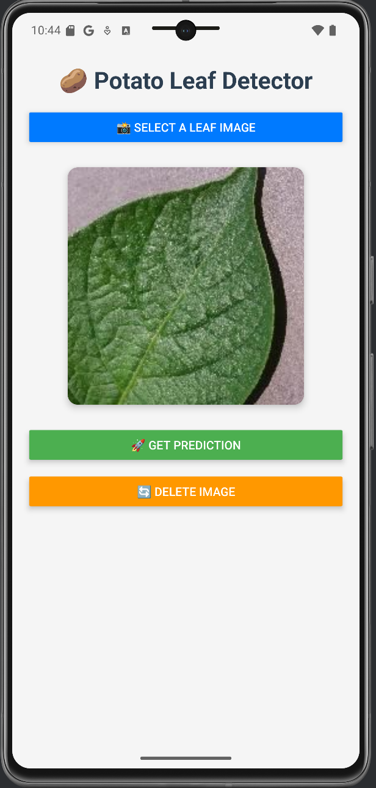
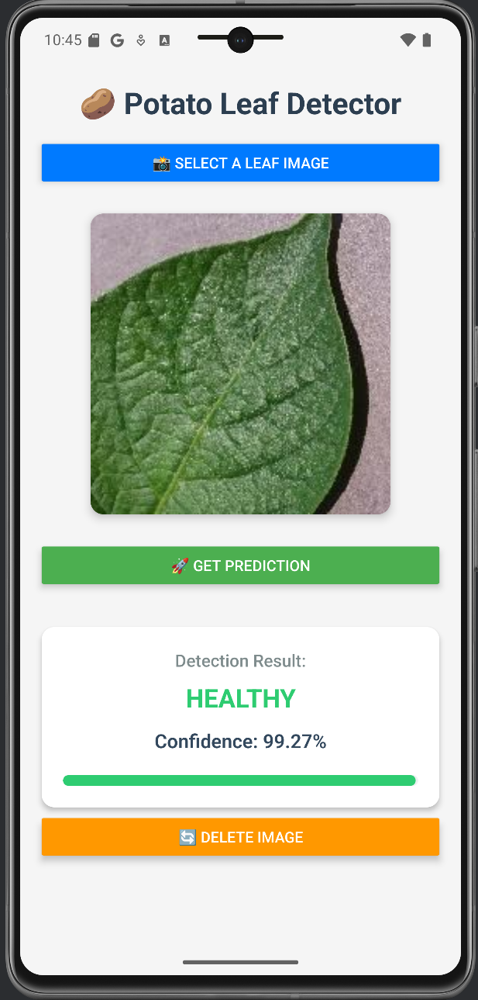
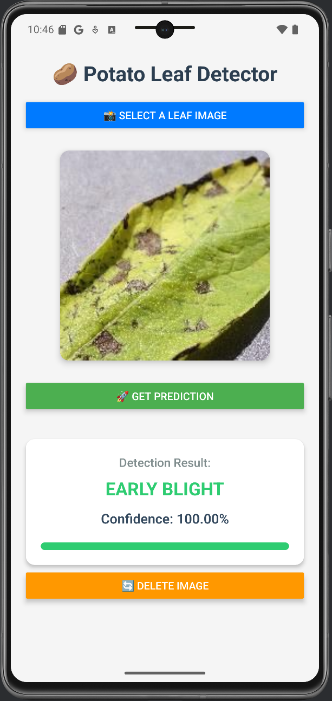
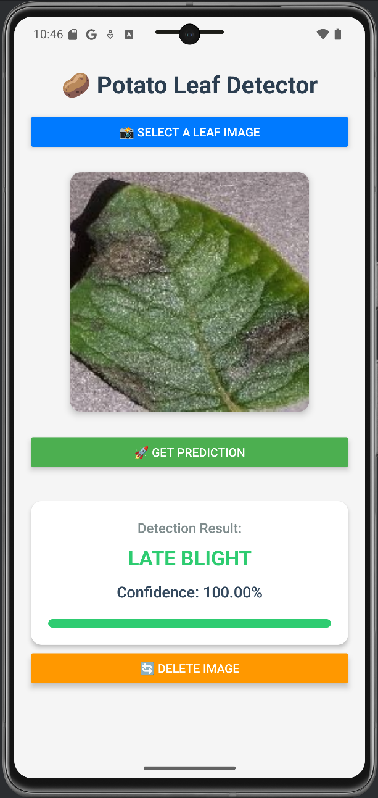

# 🥔 Potato Leaf Disease Detector

The Potato Leaf Disease Detector is a full-stack application designed to classify the health status of a potato leaf using machine learning.  

The system is split into two main components:

## ⚛️ Frontend (React Native / Expo)
This is the mobile app where users can select or take a photo of a potato leaf.  
The app handles image selection, prepares the image data for upload, and displays the final prediction result clearly.

## 🐍 Backend (FastAPI / TensorFlow)
This is the API server that receives the image file.  
It handles crucial preprocessing (resizing the image to `256 × 256` pixels), feeds the processed image into a trained TensorFlow model, and returns the classification (e.g., "Early Blight," "Late Blight," or "Healthy") along with the confidence score.

The app interface:

    
    
    
    
    

